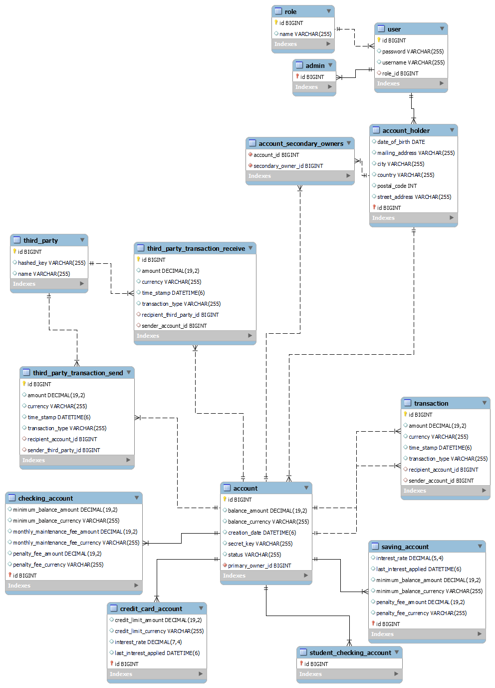

# Banking System API 
Midterm project by Urszula Figurska

This is REST API created in Spring Boot to simulate a Banking System work.
It allows to:
<ul>
  <li> Make transactions between diffierent types of accounts </li>
  <li> Make transactions between diffierent AccountHolders and also Third Parties </li>
  <li> Check your accounts balance (Account Holders only) </li>
  <li> Automatically update balance with interest and fees if applicable </li>
  <li> Check frauds and freeze accounts </li>
  <li> More functionalities for Admins: get, create and update part of information about accounts, Account Holders, Third Parties (detailes specified below) </li>
</ul>


## Setup

### Prerequisites

This a list of minimum requirements to run the program:

* [Java SE 11](https://www.oracle.com/java/technologies/javase-downloads.html)
* [MySQL Workbench 8.0 CE](https://dev.mysql.com/downloads/workbench/)

### Installation

Clone/download the repo from:
   ```sh
   git clone ...
   ```
To run this project locally do the following after cloning or downloading the project:

<ol>
  <li> Open the project on your IDE such as IntelliJ </li>
  <li> Create the databases in MySQL: midterm (for running the project) and midterm_test (for testing)</li>
  <li> Edit the application.properties file both in the main folder and test folder and insert your own credentials </li>
  <li> Go to the MidtemApplication class in the `src` directory and run main method </li>
</ol>


## Structure - accounts & parties

<ol>
  <li> The system have 4 types of accounts: StudentChecking, Checking, Savings, and CreditCard.
    <ol>
    <li> Checking Accounts have:
      <ul>
        <li>  A balance </li>
        <li>  A secretKey </li>
        <li>  A PrimaryOwner </li>
        <li>  An optional SecondaryOwner </li>
        <li>  A minimumBalance </li>
        <li>  A penaltyFee </li>
        <li>  A monthlyMaintenanceFee </li>
        <li>  A creationDate </li>
        <li>  A status (FROZEN, ACTIVE) </li>
     </ul>
   </li>
   <li>  Student Checking Accounts are identical to Checking Accounts except that they do NOT have: 
      <ul>
        <li> A monthlyMaintenanceFee </li>
        <li> A minimumBalance </li>
     </ul>
    </li>
  <li>  Savings are identical to Checking accounts except that they
      <ul>
        <li> Do NOT have a monthlyMaintenanceFee </li>
        <li> Do have an interestRate </li>
     </ul>
    </li>
  <li>  CreditCard Accounts have:
      <ul>
        <li> A balance </li>
        <li> A PrimaryOwner </li>
        <li> An optional SecondaryOwner </li>
        <li> A creditLimit </li>
        <li> An interestRate </li>
        <li> A penaltyFee </li>
     </ul>
    </li>
   </ol> 
 </li>    
    
 <li> The system must have 3 types of Users: Admins and AccountHolders.
    <ol>
    <li> The AccountHolders should be able to access their own accounts and only their accounts when passing the correct credentials using Basic Auth. AccountHolders have:
      <ul>
        <li> A name </li>
        <li> Date of birth </li>
        <li> A primaryAddress (which should be a separate address class) </li>
        <li> An optional mailingAddress </li>
     </ul>
    </li>
    <li>  Admins only have a name </li>
    <li>  The ThirdParty Accounts have a hashed key and a name. </li>
</ol>
</li>
</ol>

## Accounts - assumptions
<ol>
  <li> Checking Accounts:
      <ul>
        <li> when creating a new  account, if the primaryOwner is less than 24, a StudentChecking account should be created otherwise a regular Checking Account should be created. </li>
        <li> have a minimumBalance of 250 and a monthlyMaintenanceFee of 12 </li>
     </ul>        
  </li>
  <li> Student Checking Accounts:
      <ul>
        <li> when creating a new  account, if the primaryOwner is less than 24, a StudentChecking account should be created otherwise a regular Checking Account should be created. </li>
     </ul>      
  </li>
  <li> Savings accounts:
      <ul>  
        <li> have a default interest rate of 0.0025 </li>
        <li> may be instantiated with an interest rate other than the default, with a maximum interest rate of 0.5 </li>
        <li> interest is added to the account annually at the rate of specified interestRate per year. </li>
        <li> have a default minimumBalance of 1000 </li>
        <li> may be instantiated with a minimum balance of less than 1000 but no lower than 100 </li>
     </ul> 
  </li>
  <li> CreditCard Accounts:
      <ul>    
        <li> have a default creditLimit of 100 </li>
        <li> may be instantiated with a creditLimit higher than 100 but not higher than 100000 </li>
        <li> have a default interestRate of 0.2 </li>
        <li> may be instantiated with an interestRate less than 0.2 but not lower than 0.1 </li>
        <li> interest is added to the balance monthly. </li>
     </ul> 
  </li>
  <li> PenaltyFee (all accounts)
      <ul> 
        <li> for all accounts is 40. </li>
        <li> if any account drops below the minimumBalance, the penaltyFee is deducted from the balance automatically </li>
     </ul> 
  </li>
  <li> Fraud Detection
      <ul> 
        <li> the application recognize patterns that indicate fraud and Freeze the account status when potential fraud is detected. </li>
        <li> patterns that indicate fraud include: 
           <ul>  
              <li> Transactions made in 24 hours total to more than 150% of the customers highest daily total transactions in any other 24 hour period. </li>
              <li> More than 2 transactions occurring on a single account within a 1 second period. </li>
           </ul>                
     </ul> 
</li>
</ol>

## Account access:
<ol>
  <li> Admins:
      <ul> 
        <li> are able to access the balance for any account and to modify it. </li>
        <li> can create new Checking, Savings, or CreditCard Accounts. </li>
      </ul>        
  </li>
  <li> AccountHolders:
      <ul> 
        <li> are able to access their own account balance </li>
        <li> are able to transfer money from any of their accounts to any other account (regardless of owner). 
           <ul>          
              <li> The transfer only is processed if the account has sufficient funds. </li>
              <li> The user must provide the Primary or Secondary owner name and the id of the account that should receive the transfer. </li>
           </ul>   
        </li>              
      </ul> 
  </li>
  <li> Third-Party Users:
      <ul> 
        <li> are able to receive and send money to other accounts. 
           <ul>          
              <li> In order to receive and send money, Third-Party Users must provide their hashed key in the header of the HTTP request. </li>
              <li> They also must provide the amount, the Account id and the account secret key. </li>
           </ul>    
        </li>    
        <li> are added to the database by an admin. </li>
      </ul> 
  </li>
</ol>

## API documentation:
 
Depending on the route you are trying to access, you will need different privileges. These are the routes you can try and the permissions you will need to perform the action

<ol>
  <li> Admin routes:
      <ul> 
        <li> Accounts: </li>
        <ul>
        <li> Method: GET -- Route: /accounts -- Response: Get all accounts </li>
        <li> Method: GET -- Route: /accounts/{id} -- Response: Get account by account ID </li>
        <li> Method: PATCH -- Route: /accounts/change-balance/{id} -- Response: Update balance amount by account ID </li>
        <li> Method: PATCH -- Route: /accounts/change-status/{id} -- Response: Update status by account ID </li>
        <li> Method: GET -- Route: /checking-accounts -- Response: Get all checking accounts </li>
        <li> Method: POST -- Route: /checking-account/new -- Response: Create a new checking account </li>
        <li> Method: GET -- Route: /credit-card-accounts -- Response: Get all credit cards accounts </li>
        <li> Method: POST -- Route: /credit-card-account/new -- Response: Create a new credit card account </li>   
        <li> Method: GET -- Route: /saving-accounts -- Response: Get all saving accounts </li>
        <li> Method: POST -- Route: /saving-account/new -- Response: Create a new saving account </li>   
        <li> Method: GET -- Route: /student-checking-accounts -- Response: Get all student checking accounts </li>
        <li> Method: POST -- Route: /student-checking-account/new -- Response: Create a new student checking account </li>   
        <li> Method: GET -- Route: /transactions -- Response: Get all transactions (internal) </li>
        <li> Method: GET -- Route: /third-party-send-transactions -- Response: Get all third party send transactions </li>
        <li> Method: GET -- Route: /third-party-receive-transactions -- Response: Get all third party send transactions </li>
        </ul>        
        <li> Account Holders: </li>
        <ul>        
            <li> Method: GET -- Route: /account-holders -- Response: Get all Account Holders </li>
            <li> Method: GET -- Route: /account-holders/{id} -- Response: Get Account Holder by Account Holder ID </li>
            <li> Method: POST -- Route: /account-holders/new -- Response: Create a new Account Holder </li>
        </ul>        
        <li> Third Parties: </li>
        <ul>        
        <li> Method: GET -- Route: /third-parties -- Response: Get all Third Parties </li>
        <li> Method: POST -- Route: /third-parties/new -- Response: Create a new Third Party </li>    
        </ul>        
      </ul>    
  </li>
    <li> User routes:
      <ul> 
        <li> Method: GET -- Route: /my-accounts/primary/ -- Response: Get all primary accounts of a user by Account Holder ID </li>
        <li> Method: GET -- Route: /my-accounts/secondary -- Response: Get all secondary accounts of a user by Account Holder ID </li>
        <li> Method: GET -- Route: /my-accounts/{id}/balance -- Response: Get balance by account ID </li>
        <li> Method: POST -- Route: /transfer -- Response: Make a transaction between accounts </li> 
        <li> Method: POST -- Route: /third-party/send-money/{hashed-key} -- Response: Send money from accounts to Third Party by Hashed key</li> 
      </ul>    
  </li>
    <li> Third Party routes:
      <ul> 
        <li> Method: GET -- Route: /third-party/receive-money/{hashed-key} -- Response: Get transactions with received money from accounts by Hashed key</li>
        <li> Method: GET -- Route: /third-party/send-money/{hashed-key} -- Response: Get transactions with sent money from accounts by Hashed key</li>
        <li> Method: POST -- Route: /third-party/send-money/{hashed-key} -- Response: Send money to accounts by Hashed key</li>
      </ul>    
  </li>
</ol>
## Database diagram:


Thank you